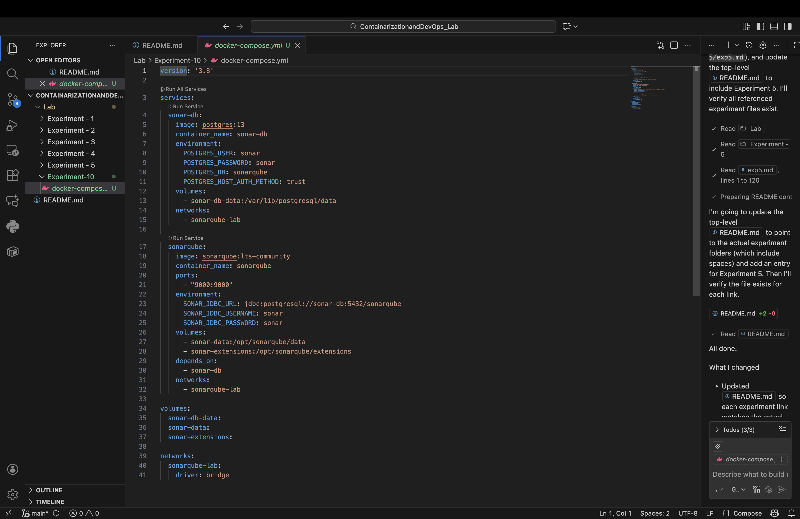
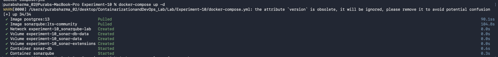
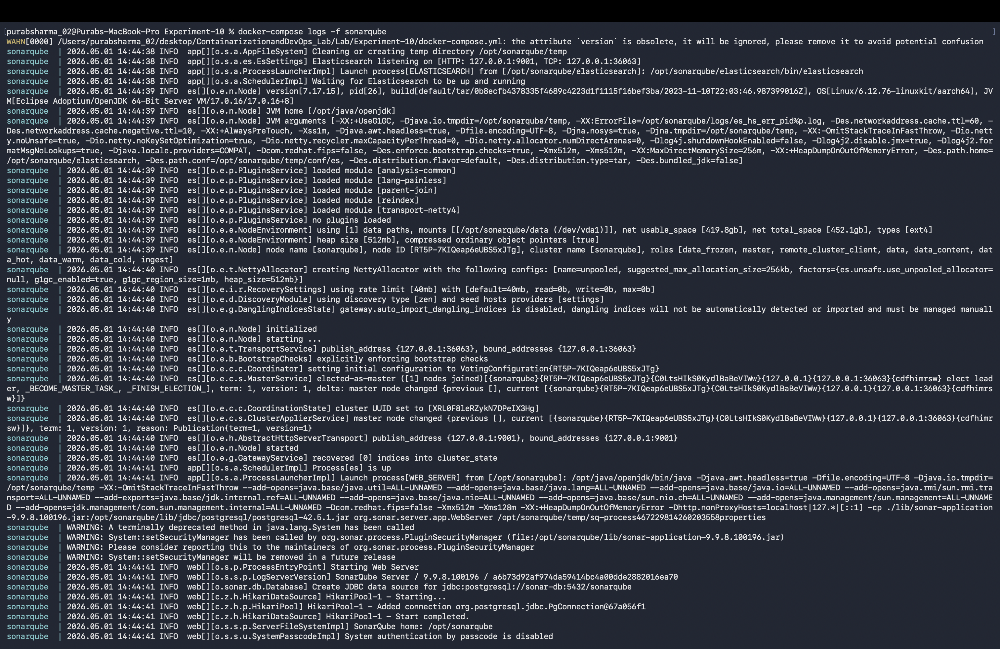
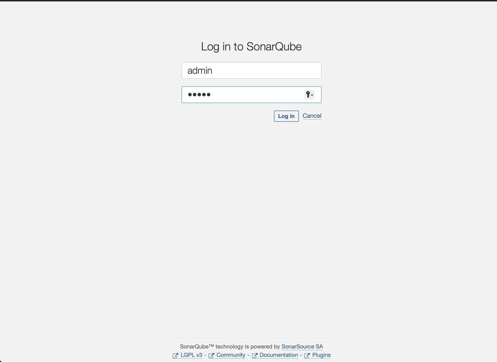
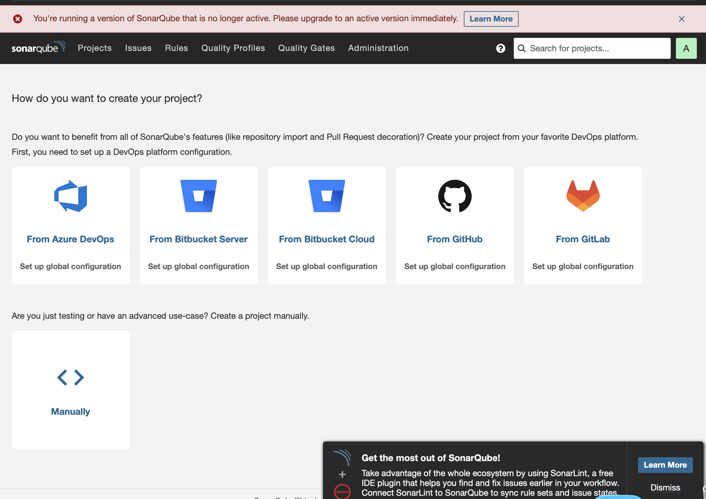
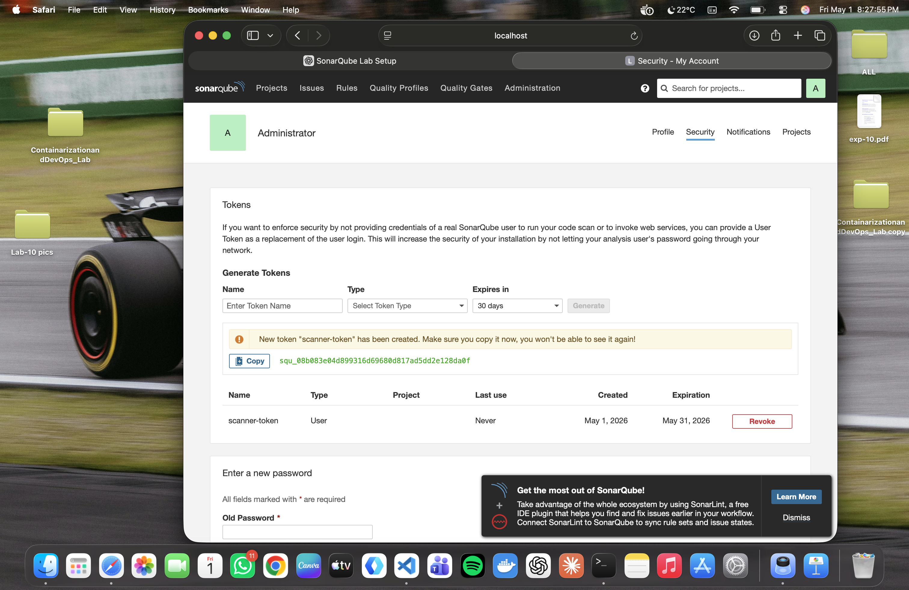
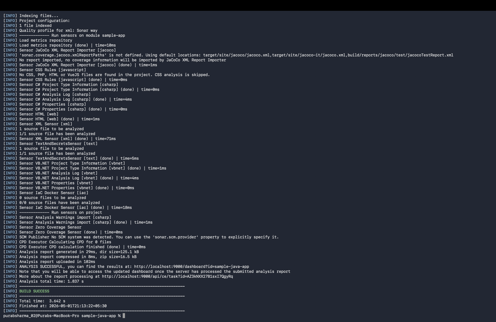
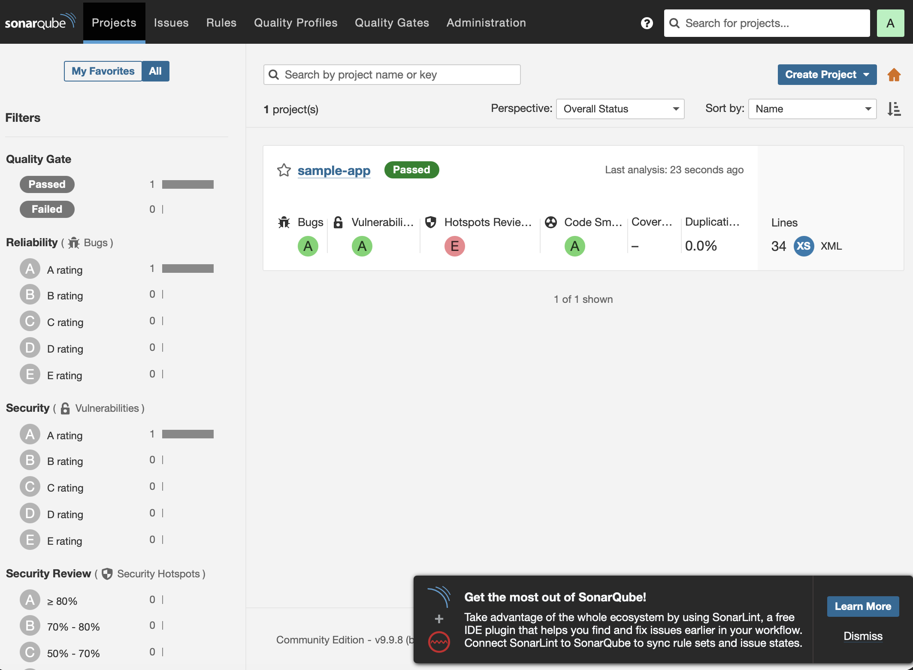
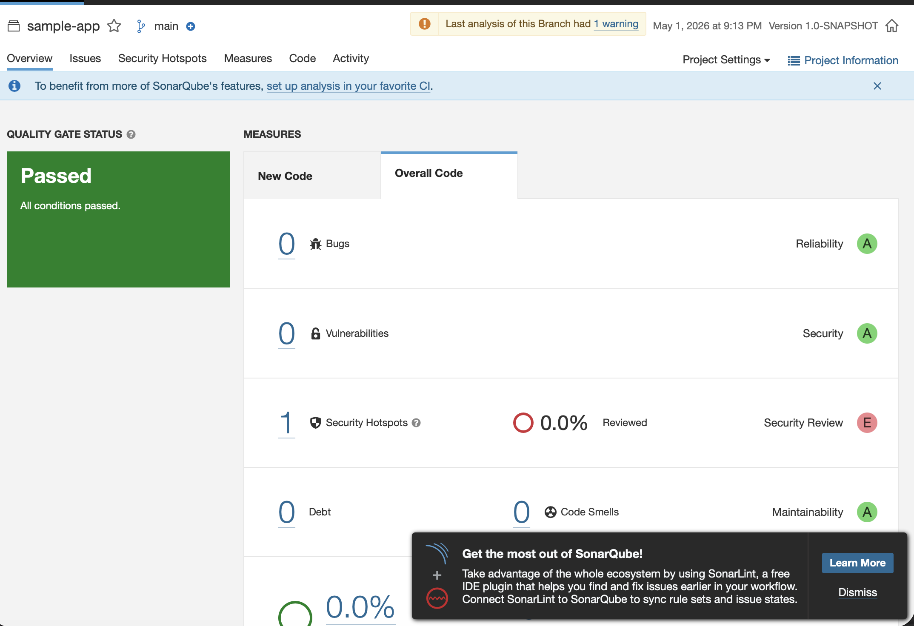

# Experiment 10: SonarQube — Static Code Analysis

---

##  Objective

To understand and implement static code analysis using SonarQube for detecting bugs, vulnerabilities, and code smells in a Java application.

---

##  Theory

### What is SonarQube?

SonarQube is an open-source platform used for **static code analysis**. It scans source code without executing it and identifies:

* Bugs 
* Security Vulnerabilities 
* Code Smells 

---

###  Key Features

* Automated code scanning
* Quality Gates for pass/fail criteria
* Tracks technical debt
* Supports multiple languages
* Provides visual dashboard

---

###  Key Terms

| Term           | Description          |
| -------------- | -------------------- |
| Bug            | Code that may fail   |
| Vulnerability  | Security weakness    |
| Code Smell     | Poor coding practice |
| Quality Gate   | Pass/Fail criteria   |
| Technical Debt | Effort to fix issues |

---

##  Architecture

* **SonarQube Server** → analyzes and displays results
* **Scanner (Maven/CLI)** → sends code for analysis
* **Database (PostgreSQL)** → stores results

---

##  Tools Used

* Docker & Docker Compose
* SonarQube
* Maven
* Java

---

##  Implementation Steps

---

###  Step 1: Create Project Directory

```bash
mkdir sonarqube-lab
cd sonarqube-lab
```

---

###  Step 2: Create docker-compose.yml

```yaml
version: '3.8'

services:
  sonar-db:
    image: postgres:13
    environment:
      POSTGRES_USER: sonar
      POSTGRES_PASSWORD: sonar
      POSTGRES_DB: sonarqube
      POSTGRES_HOST_AUTH_METHOD: trust

  sonarqube:
    image: sonarqube:lts-community
    ports:
      - "9001:9000"
    environment:
      SONAR_JDBC_URL: jdbc:postgresql://sonar-db:5432/sonarqube
      SONAR_JDBC_USERNAME: sonar
      SONAR_JDBC_PASSWORD: sonar
    depends_on:
      - sonar-db
```

---

###  Step 3: Start SonarQube Server

```bash
docker-compose up -d
docker-compose logs -f sonarqube
```

Wait until:

```
SonarQube is operational
```

---

###  Step 4: Open Dashboard

Open in browser:

```
http://localhost:9001
```

Login:

* Username: admin
* Password: admin

---

###  Step 5: Generate Token

* Go to **My Account → Security**
* Generate token
* Copy token

---

###  Step 6: Create Sample Java Project

```bash
mkdir sample-java-app
cd sample-java-app
mkdir -p src/main/java/com/example
```

---

###  Step 7: Create Java File

```java
package com.example;

public class Calculator {

    public int divide(int a, int b) {
        return a / b;
    }

    public int add(int a, int b) {
        int result = a + b;
        int unused = 100;
        return result;
    }

    public String getUser(String userId) {
        return "SELECT * FROM users WHERE id = " + userId;
    }

    public String getName(String name) {
        return name.toUpperCase();
    }
}
```

---

###  Step 8: Create pom.xml

```xml
<project xmlns="http://maven.apache.org/POM/4.0.0">
  <modelVersion>4.0.0</modelVersion>

  <groupId>com.example</groupId>
  <artifactId>sample-app</artifactId>
  <version>1.0-SNAPSHOT</version>

  <properties>
    <sonar.projectKey>sample-java-app</sonar.projectKey>
    <sonar.host.url>http://localhost:9001</sonar.host.url>
    <sonar.login>YOUR_TOKEN</sonar.login>
  </properties>

  <build>
    <plugins>
      <plugin>
        <groupId>org.sonarsource.scanner.maven</groupId>
        <artifactId>sonar-maven-plugin</artifactId>
        <version>3.9.1.2184</version>
      </plugin>
    </plugins>
  </build>
</project>
```

---

###  Step 9: Run Analysis

```bash
mvn clean verify sonar:sonar
```

---

###  Step 10: View Results

Open:

```
http://localhost:9001
```

Select project: **sample-java-app**






---

##  Expected Output

* Bugs detected
* Vulnerabilities identified
* Code smells reported
* Quality Gate status displayed

---

##  Result

SonarQube successfully analyzed the Java application and detected multiple issues, demonstrating the effectiveness of static code analysis.

---

##  Conclusion

SonarQube improves code quality by identifying errors early in development. It helps maintain secure, clean, and maintainable code through automated analysis.

---