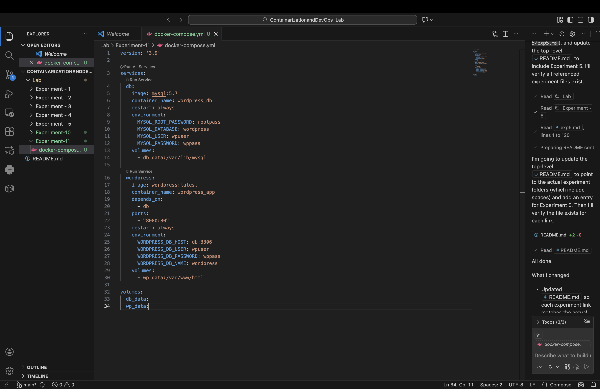
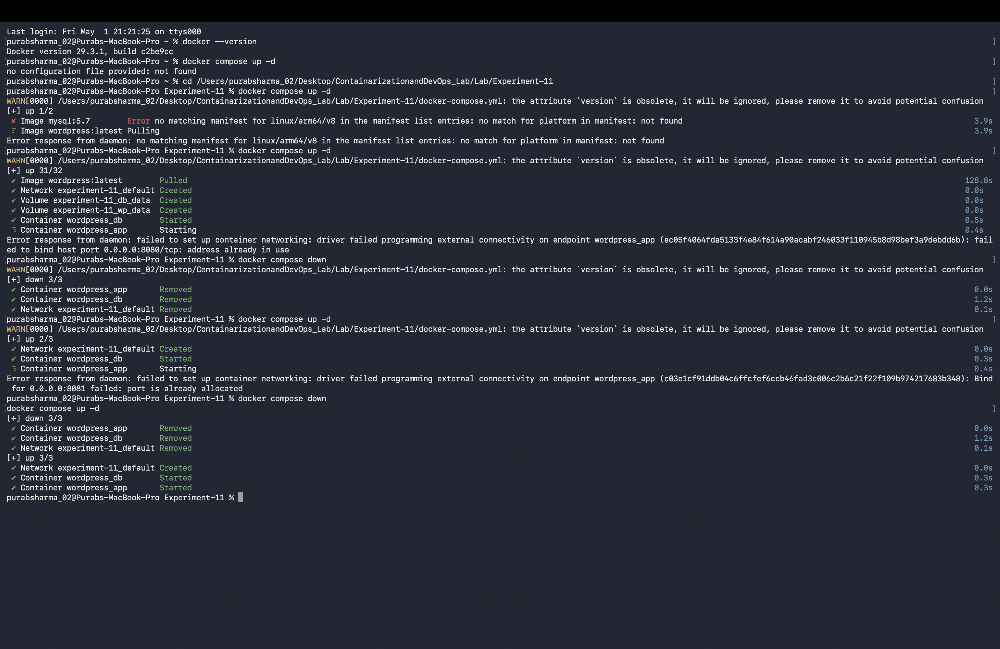
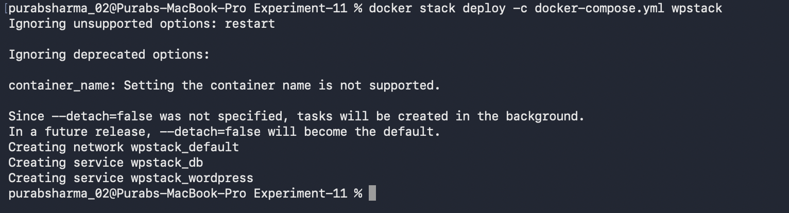
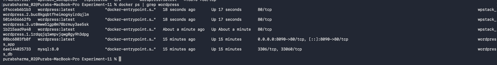
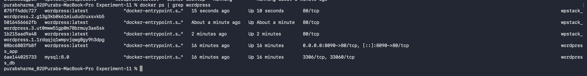

# Experiment 11: Orchestration using Docker Compose & Docker Swarm

---

##  Objective

To understand container orchestration using Docker Swarm by deploying, scaling, and managing a multi-container WordPress application.

---

## Theory

### What is Docker Swarm?

Docker Swarm is a container orchestration tool that allows you to manage a cluster of Docker nodes as a single system. It provides features like:

* Service management
* Load balancing
* Scaling
* Self-healing

---

###  Key Concepts

| Term    | Description                    |
| ------- | ------------------------------ |
| Node    | A machine in the Swarm cluster |
| Manager | Controls the cluster           |
| Worker  | Executes tasks                 |
| Service | Definition of container(s)     |
| Stack   | Group of services              |
| Replica | Number of container instances  |

---

##  Tools Used

* Docker Desktop
* Docker Compose
* Docker Swarm

---

##  Implementation Steps

---

###  Step 1: Create Project Directory

```bash
mkdir Experiment-11
cd Experiment-11
```

---

###  Step 2: Create docker-compose.yml

```yaml
version: '3.9'

services:
  db:
    image: mariadb:10.6
    environment:
      MYSQL_ROOT_PASSWORD: rootpass
      MYSQL_DATABASE: wordpress
      MYSQL_USER: wpuser
      MYSQL_PASSWORD: wppass
    volumes:
      - db_data:/var/lib/mysql

  wordpress:
    image: wordpress:latest
    ports:
      - "8081:80"
    environment:
      WORDPRESS_DB_HOST: db:3306
      WORDPRESS_DB_USER: wpuser
      WORDPRESS_DB_PASSWORD: wppass
      WORDPRESS_DB_NAME: wordpress
    volumes:
      - wp_data:/var/www/html
    deploy:
      restart_policy:
        condition: on-failure

volumes:
  db_data:
  wp_data:
```

---

###  Step 3: Clean Previous Setup

```bash
docker compose down -v
docker rm -f $(docker ps -aq)
docker network prune -f
```

---

###  Step 4: Initialize Docker Swarm

```bash
docker swarm init
```

Verify:

```bash
docker node ls
```


---

###  Step 5: Deploy Stack

```bash
docker stack deploy -c docker-compose.yml wpstack
```


---

###  Step 6: Verify Services

```bash
docker service ls
```

---

###  Step 7: Check Running Containers

```bash
docker ps
```


---

###  Step 8: Access Application

Open browser:

```
http://localhost:8080
```

---

###  Step 9: Scale Application

```bash
docker service scale wpstack_wordpress=3
```

Verify:

```bash
docker service ls
```


---

###  Step 10: Test Self-Healing

```bash
docker ps | grep wordpress
docker kill <container-id>
docker service ps wpstack_wordpress
```



---

###  Step 11: Remove Stack

```bash
docker stack rm wpstack
```


---

##  Result

* Docker Swarm initialized successfully
* WordPress stack deployed using Docker Compose
* Services scaled to multiple replicas
* Self-healing demonstrated successfully
* Stack removed after completion

---

##  Conclusion

Docker Swarm enables efficient orchestration of containers by providing features like scaling, load balancing, and automatic recovery, making it suitable for managing distributed applications.

---

## Key Takeaways

* Swarm converts Docker into a cluster manager
* Services manage containers automatically
* Scaling increases availability
* Self-healing ensures reliability
* Stack simplifies multi-container deployment

---