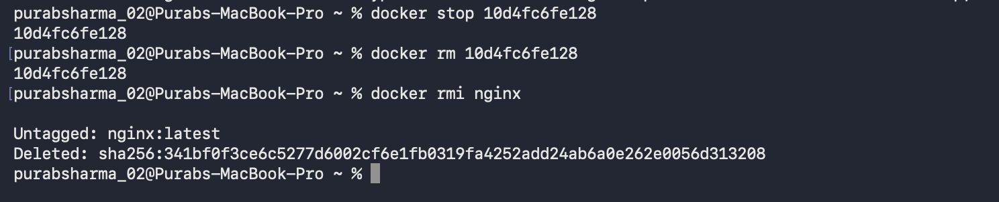

# Experiment 2

## Title
Docker Installation, Configuration, and Running Images

---

## Objective
To pull Docker images, run containers with port mapping, and manage the container lifecycle using Docker commands.

---

## Tools Used
- Docker
- Docker Desktop
- macOS Terminal
- Nginx Docker Image

---

## Theory
Docker is a containerization platform that allows applications to run in isolated environments called containers. Docker images act as templates for containers. Containers can be started, stopped, and removed easily using Docker lifecycle commands.

---

## Procedure

### Step 1: Pull Docker Image and Run Container
The Nginx Docker image was pulled from Docker Hub and a container was started with port mapping.

```bash
docker pull nginx
docker run -d -p 8080:80 nginx
```


---

### Step 2: Verify Running Containers
The list of running containers was checked to confirm the Nginx container is active.

```bash
docker ps
```


---

### Step 3: Test Container Connectivity
Verified that the container is responding on the mapped port.


---

### Step 4: Stop and Remove Docker Container
The running container was stopped and removed from the system.

```bash
docker stop <container_id>
docker rm <container_id>
docker rmi nginx
```


## Commands Used

```bash
docker pull nginx                    # Pull Nginx image from Docker Hub
docker run -d -p 8080:80 nginx       # Run container with port mapping
docker ps                             # List running containers
docker stop <container_id>           # Stop a running container
docker rm <container_id>             # Remove a container
docker rmi nginx                     # Remove the Docker image
```

## Result

Docker images were successfully pulled from Docker Hub, containers were executed with port mapping enabled, and all container lifecycle commands (start, verify, stop, and remove) were performed successfully. The experiment demonstrated the complete Docker workflow from image retrieval to container management.